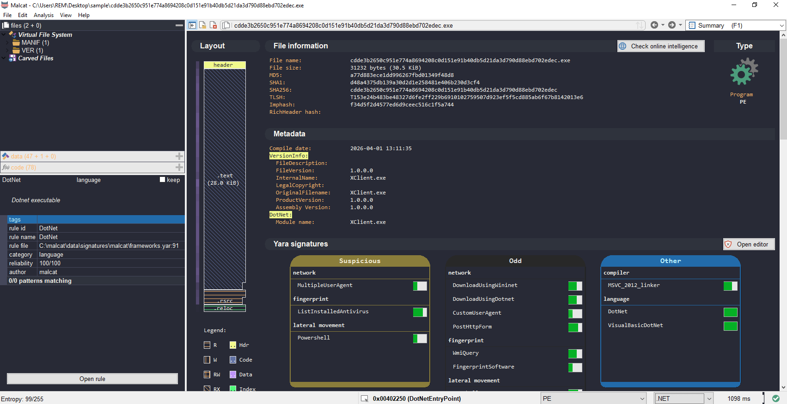
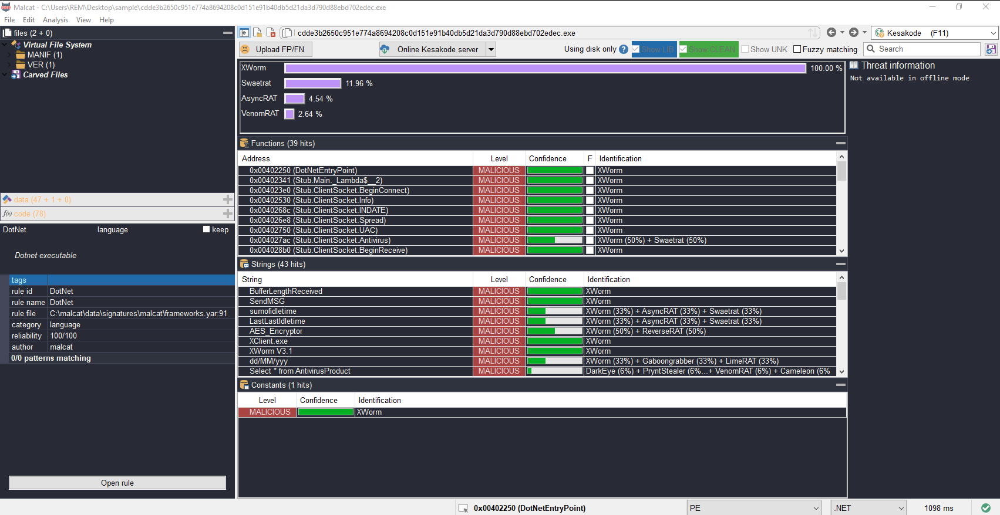

# XWorm V3.1 — Static Configuration Extraction & Scalable Detection

## Overview

**XWorm** is a widely used Remote Access Trojan (RAT) that has been actively observed in campaigns since at least 2022. It is commonly distributed through phishing emails and multi-stage loaders, and is frequently sold or shared in underground forums, making it accessible to a broad range of threat actors.

Written in VB.NET, XWorm provides operators with a full set of remote control capabilities:

- Remote command execution  
- Keylogging and activity monitoring  
- Webcam and screen capture  
- File management and plugin execution  
- DDoS functionality  

XWorm infections have been observed across a wide range of targets, including small businesses and enterprise environments. Once deployed, it provides attackers with full remote access to the infected system, enabling data theft, surveillance, and further payload delivery.

---

## Key Observation

Across multiple samples, XWorm V3.x exhibits a consistent pattern:

> The malware stores its Command & Control (C2) configuration as **encrypted Base64 strings inside the `.NET #US metadata stream`**

This approach:

- Hides configuration from basic string analysis  
- Avoids obvious plaintext indicators  
- Remains fully reversible through static analysis  

---

## Objective

This analysis demonstrates how to:

- Identify a XWorm sample and confirm its family  
- Locate encrypted configuration data within .NET metadata  
- Reverse the encryption routine used by the malware  
- Extract the full C2 configuration without executing the binary  
- Scale the approach using automated tooling  

The methodology is validated against a dataset of:

> **100+ XWorm V3.x samples**, confirming that the technique generalizes across multiple campaigns.

---

## Static Analysis

### Sample Overview & Identification

The sample was initially inspected using **Malcat**, which provides a consolidated view of file structure, metadata, and detection results.

  

<em>Figure 1 — Malcat overview showing file metadata and hashes</em>

Key observations:

- File type: PE32 executable (.NET assembly)  
- Language: VB.NET  
- Internal name: `XClient.exe`  
- CLR version: v4.0  
- No packing or obfuscation detected  

Malcat also provides an initial classification of the sample:

  

<em>Figure 2 — Malcat classification identifying the sample as XWorm</em>

This classification indicates that the sample likely belongs to the **XWorm family**. While this provides a strong initial signal, the attribution will be validated in the following steps by analyzing the binary structure, .NET metadata, and embedded artifacts.

---
