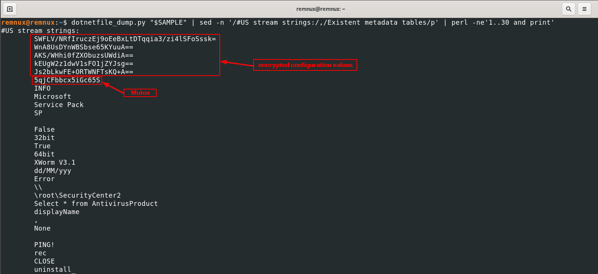
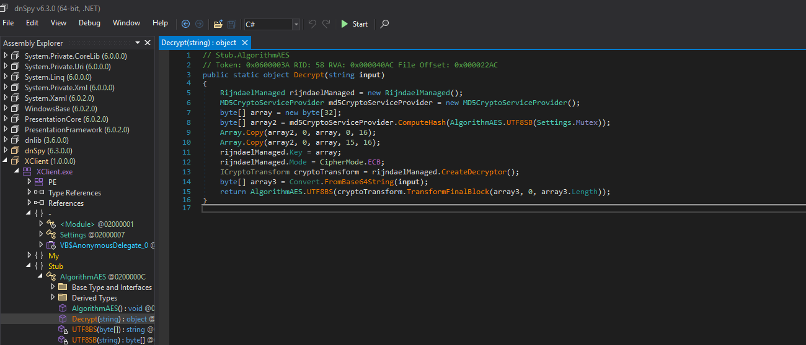
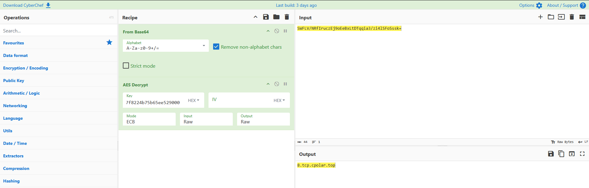

## Overview

**XWorm** is a widely used Remote Access Trojan (RAT) that has been actively observed in campaigns since at least 2022. It is commonly distributed through phishing emails and multi-stage loaders, and is frequently sold or shared in underground forums, making it accessible to a broad range of threat actors.

Written in VB.NET, XWorm provides operators with a full set of remote control capabilities:

- Remote command execution  
- Keylogging and activity monitoring  
- Webcam and screen capture  
- File management and plugin execution  
- DDoS functionality  

XWorm infections have been observed across a wide range of targets, including small businesses and enterprise environments. Once deployed, it provides attackers with full remote access to the infected system, enabling data theft, surveillance, and further payload delivery.

## Key Observation
Across multiple samples spanning several XWorm versions and campaigns, a consistent configuration storage pattern is observed, suggesting that the underlying design has remained stable across iterations of the malware:

> The malware stores its Command & Control (C2) configuration as **encrypted Base64 strings inside the `.NET #US metadata stream`**

This approach:

- Hides configuration from basic string analysis  
- Avoids obvious plaintext indicators  
- Remains fully reversible through static analysis  

## Objective

This analysis demonstrates how to:

- Identify a XWorm sample and confirm its family  
- Locate encrypted configuration data within .NET metadata  
- Reverse the encryption routine used by the malware  
- Extract the full C2 configuration without executing the binary  
- Scale the approach using automated tooling  
- Analyze infrastructure patterns across multiple samples

## Static Analysis

### Sample Overview & Identification

The sample was initially inspected using **Malcat**, which provides a consolidated view of file structure, metadata, and detection results.

<p align="center">
  
</p>
<p align="center"><em>Figure 1 — Malcat overview showing file metadata and hashes</em></p>

Key observations:

- File type: PE32 executable (.NET assembly)  
- Language: VB.NET  
- Internal name: `XClient.exe`  
- CLR version: v4.0  
- No packing or obfuscation detected  

Malcat also provides an initial classification of the sample:

<p align="center">
  
</p>
<p align="center"><em>Figure 2 — Malcat classification identifying the sample as XWorm</em></p>

This classification indicates that the sample likely belongs to the **XWorm family**. While this provides a strong initial signal, the attribution will be validated in the following steps by analyzing the binary structure, .NET metadata, and embedded artifacts.

### .NET Metadata Inspection

After the initial identification, the next step is to inspect the **.NET metadata**, since this is where XWorm stores critical runtime data.

To extract this information, the sample was parsed using:

```bash
dotnetfile_dump.py /full/path/to/sample.exe
```
The most relevant data is found in the #US stream, which contains runtime strings embedded directly in the binary.

<p align="center">  </p> <p align="center"><em>Figure 3 — #US stream showing runtime strings and embedded configuration</em></p>

Several important indicators are immediately visible:

| Indicator |
|----------|
| XWorm V3.1 |
| PING! CLOSE uninstall update |
| Select * from AntivirusProduct |

These strings confirm the malware family and version (XWorm V3.1), the presence of a command-based C2 protocol, the use of PowerShell for execution, and antivirus enumeration via WMI.

More importantly, the stream also contains the following values:
| Value |
|------|
| SWFLV/NRfIruczEj9oEeBxLtDTqqia3/zi4lSFoSssk= |
| WnA8UsDYnWBSbse65KYuuA== |
| AKS/WHhi0fZXObuzsUWdiA== |
| kEUgW2z1dwV1sFO1jZYJsg== |
| Js2bLkwFE+ORTWNFTsKQ+A== |
| 5qjCFbbcx5iGc65S |

These values are significant:

- The Base64 strings correspond to encrypted configuration values
- The plaintext value (5qjCFbbcx5iGc65S) is the Mutex

  This is sufficient to proceed with reversing the encryption routine and recovering the full configuration without executing the malware.

---

## Decryption Example with CyberChef
To demonstrate the decryption process manually, the following example uses:

- Mutex: 5qjCFbbcx5iGc65S
- Ciphertext (Base64): SWFLV/NRfIruczEj9oEeBxLtDTqqia3/zi4lSFoSssk=

According to the decompiled code, the decryption routine works as follows:
<p align="center">
  
</p>
<p align="center"><em>Figure 4 — XWorm AES decryption routine showing MD5-based key derivation and ECB mode</em></p>

Each step of the decryption routine can be directly observed in the code:

- **MD5 key derivation**  
  The mutex (`Settings.Mutex`) is hashed using `MD5CryptoServiceProvider.ComputeHash(...)`.

- **AES-256 key construction**  
  A 32-byte array is created, where the MD5 value is copied twice with an overlap at offset 15:
  ```csharp
  Array.Copy(array2, 0, array, 0, 16);
  Array.Copy(array2, 0, array, 15, 16);
   ```
- **AES configuration**  
  The malware uses RijndaelManaged with key size 256 bits and ECB mode.

- **Decryption process**
  The resulting bytes are converted to UTF-8, with PKCS#7 padding removed as part of the decryption process.  
  ```csharp
  TransformFinalBlock(...)
   ```
  
The important detail is that the key derivation is not a normal MD5 repeat.
Instead, the malware creates the key with an overlapping copy:

```bash
key[0:16]  = MD5(Mutex)
key[15:31] = MD5(Mutex)
key[31]    = 0x00
```
This means the second copy starts at offset 15, so one byte overlaps.

### Step 1 - Compute the MD5 of the Mutex
In CyberChef, start with this input:
```bash
5qjCFbbcx5iGc65S
```
Use this recipe:
```bash
MD5
To Hex
```
This gives the 16-byte MD5 value used as the basis for the AES key.

### Step 2 - Build the AES Key
Once the MD5 is obtained, the malware constructs a 32-byte key like this:

- bytes `0..15` = MD5
- bytes `15..30` = MD5 again
- byte `31` = `00`
This is important because it is not a simple `MD5 + MD5` concatenation.
The second copy begins at byte 15, which creates an overlap.

For example, if the MD5 were:
```bash
aa bb cc dd ee ff 11 22 33 44 55 66 77 88 99 00
```
the final key would look like:
```bash
aa bb cc dd ee ff 11 22 33 44 55 66 77 88 99 aa bb cc dd ee ff 11 22 33 44 55 66 77 88 99 00 00
```
In practice, the easiest approach is to calculate the final key outside CyberChef and then paste it into the AES operation.


### Step 3 - Decrypt the Ciphertext in CyberChef
Now use the encrypted Host value:
```bash
SWFLV/NRfIruczEj9oEeBxLtDTqqia3/zi4lSFoSssk=
```
Use the following CyberChef recipe:
```bash
From Base64
AES Decrypt
Decode text
```
Configure AES Decrypt as follows:

- Mode: ECB
- Key: derived 32-byte key
- Key format: Hex
- IV: empty
- Padding: remove PKCS#7 padding if needed

If the correct key is used, the decrypted value resolves to the C2 host.
```text
8.tcp.cpolar.top
 ```
<p align="center">  </p> <p align="center"><em>Figure 5 — CyberChef decryption process showing AES-256-ECB configuration and recovered C2 host</em></p>

## Automating Configuration Extraction

While the manual approach using CyberChef is useful to understand the decryption process, it does not scale when analyzing large numbers of samples.

To address this, the full workflow was automated in the following tool:
[xworm-v3x-config-extractor-yara](https://github.com/lsuastegui/xworm-config-extractor-yara)

## Infrastructure Analysis (Cross-Sample Observations)
To analyze infrastructure at scale, the extractor was executed across a dataset of 100+ XWorm samples, recovering one C2 endpoint per sample. The results were then aggregated and deduplicated.
```bash
for f in *; do
    file "$f" | grep -q "PE32" && \
    python3 xworm_extractor.py "$f" 2>/dev/null | \
    grep "C2 endpoint" | cut -d':' -f2- | xargs
done | sort | uniq
```
### Observed Infrastructure and Builder Patterns
The extracted configuration data and builder artifacts reveal consistent patterns not only in infrastructure usage, but also in how the malware is built, distributed, and operated across campaigns.

| Category | Description | Examples | Implication |
|----------|------------|----------|-------------|
| Tunneling Services | Use of third-party NAT traversal services to expose local services | cpolar, pinggy, localto, portmap.host, ply.gg | Bypasses NAT/firewalls and enables rapid deployment |
| Dynamic DNS (DDNS) | Domains resolving to frequently changing IP addresses | duckdns.org, bounceme.net, ddns.com.br | Enables IP rotation and persistence |
| Randomized Subdomains | High-entropy or auto-generated hostnames | q4k7uphvys.localto.net, g6rfsuscw9.localto.net | Indicates automated infrastructure provisioning |
| Public Platforms | Use of legitimate services for staging or configuration delivery | pastebin.com | Adds indirection and complicates detection |
| Version Distribution | Multiple XWorm versions observed across samples | V5.x, V6.x, V7.x | Indicates dataset spans multiple campaigns and timeframes |
| Builder Attribution | References to builder sources and forks | c3lestial.fun, celestialproject.org, XHubTools | Suggests distribution through underground communities and builder reuse |
| Operator Identifiers | Custom or user-defined values | PLEINPLEIN777, Hassanat, DDD | May reflect operator aliases, campaign names, or test artifacts |
| Default Values | Common builder defaults reused across samples | USB.exe, Bind, TEST | Indicates low customization and widespread use of stock configurations |
| Masquerading | Names mimicking legitimate processes or system components | Windows Defender Firewall, ms-update.exe | Basic evasion through deceptive naming |

### Key Takeaways

The observed patterns indicate that XWorm operates as a commodity malware ecosystem, combining disposable infrastructure with widely distributed builders and low-cost operational practices.

This model enables:

- Rapid provisioning and rotation of C2 infrastructure  
- Distribution through publicly available builders and forks  
- Minimal operator effort through reuse of default configurations  
- Evasion of static detection via dynamic DNS and tunneling services  

As a result, traditional IOC-based detection is largely ineffective. Detection strategies should instead focus on behavioral patterns, infrastructure usage, and configuration artifacts shared across samples.
